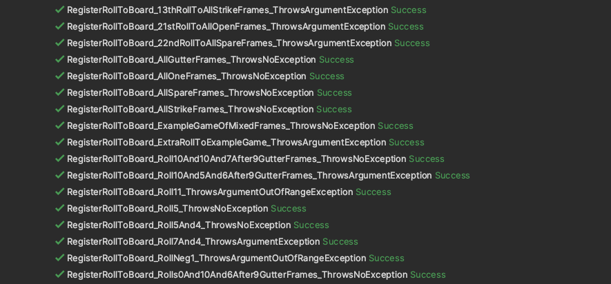
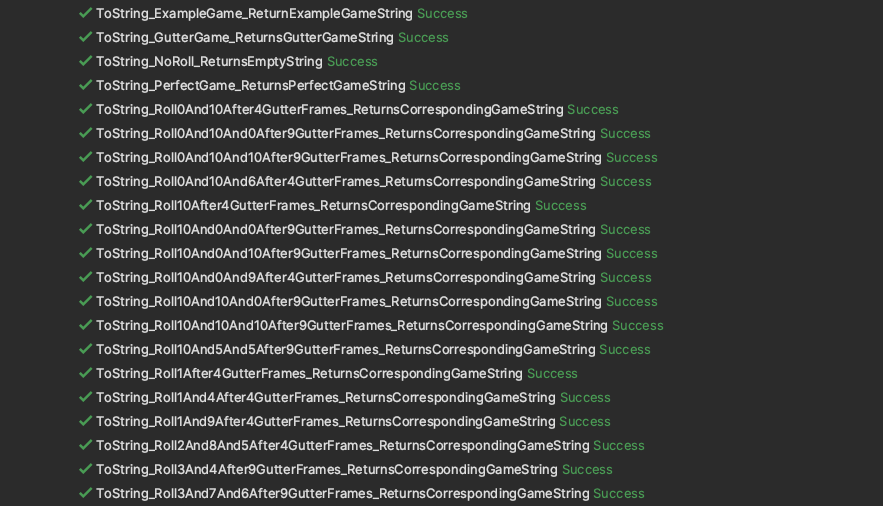
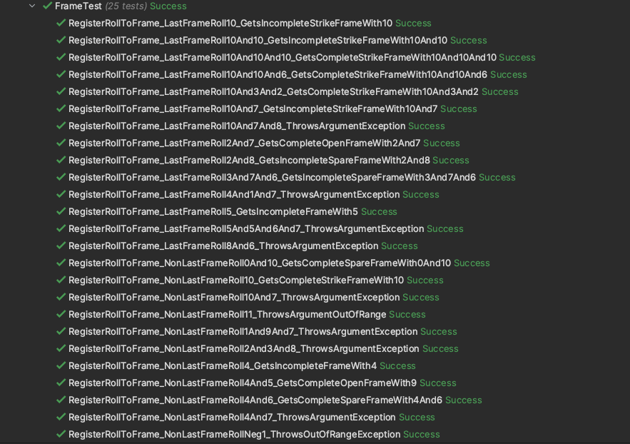

## 1 Introduction

In this coding task, we are to design a scoreboard for [ten-pin bowling]( https://en.wikipedia.org/wiki/Ten-pin_bowling) using C# on .NET. The rules of ten-pin bowling can be summarized as follows:

* Each game consists of ten frames. In each frame, a player has two opportunities (rolls) to knock down all the ten pins.
* In each frame, if a player knocks down all the pins with the **first** (resp. **second**) roll, then this is a **strike** (resp. **spare**) frame. Otherwise, it is an **open** frame.
* If the last frame is a **strike** (resp. **spare**), the player has **two** (resp. **one**) more bonus rolls.
* The score of a **strike** (resp. **spare**) frame equals the pins knocked down in the current frame (i.e. $10$) plus that in the next **two** (resp. **one**) rolls.  The score of an **open** frame is the number of pins knocked down in that frame.
* The final score is the sum of the score of all frames.

## 2 Design of the Scoreboard

### 2.1 Analysis of the Requirement

Based on the rule of a bowling game, a scoreboard should support the following operations:

1. **Register a roll to the scoreboard.** After each roll, we should be able to register the result, i.e., the number of pins knocked down, to the scoreboard. The scoreboard should then update the current score if needed upon receiving a new roll. 
2. **Display the scoreboard.** As a scoreboard, it should be able to display the current status of the game, i.e., the result of each frame so far and the current total score. 
   * We remark that according to the bowling convention, a roll that results in a strike frame should be marked as `X`, and a roll that results in a spare frame should be marked as `/`. Otherwise it is marked as the number of pins it knocks down.
3. **Clear the scoreboard.** We should be able to clear the scoreboard for a new game.
4. **Provide the current total score**. It will be helpful to have the functionality of providing the current total score of the game.

### 2.2 Our Design

Conceptually, it will be simpler and cleaner to encapsulate the relevant game information into a `BowlingScoreboard` class, and only expose methods for registering a roll, displaying the scoreboard, clearing the scoreboard, and fetching the current score.

Inside the `BowlingScoreboard` class, we make another layer of abstraction to separate frame-specific information and operations into another class `Frame`. This is based on the fact that each game consists of ten frames, and each frame is a relatively self-contained entity, i.e., it has its own rolls, types, etc. Furthermore, the calculation of the current score and the displaying of the scoreboard both rely heavily on the concept of frames.

For convenience, we define a `FrameType` enum type, which consists of three values `FrameType.Open`, `FrameType.Spare`, `FrameType.Strike`.

We now provide a bit more details of the two main classes we design.

#### 2.2.1 The `Frame` Class

The `Frame` class encapsulates the logic of actually registering a roll to a frame, which includes validating the roll data, adding the roll to the list of rolls this frame consists of, updating the frame type, and deciding if this frame is complete.

It consits of the following properties with public getters:

* `public bool IsComplete`: indicating if the current frame is complete.
* `public List<int> FrameRolls`: the rolls this frame consists of.
* `public FrameType FrameType`: the type of this frame, which can be `FrameType.Strike`,  `FrameType.Spare`, or `FrameType.Open`.

It provides the following public method for `BowlingScoreboard` to invoke.

* `public void RegisterRollToFrame(int pins, bool isLastFrame)`: register a roll to the frame, which includes adding the roll to `FrameRolls`, and potentially updating `IsComplete` and `FrameType` of the frame.

We ignore the details of private methods in `Frame` that are used to help handle roll registration.

#### 2.2.2 The `BowlingScoreboard` Class

The `BowlingScoreboard` is the main class in the system. It maintains a list of frames and a list of cumulative frame scores. Upon receiving an input roll for registration, it first validates if the roll can be added, i.e., if the game is over, and then invokes the `RegisterRollToFrame()` method of the current frame. Depending on if the current frame is complete, it may create a new frame. Then it updates the cumulative frame score list. Using the frame list and the cumulative frame score list, it provides interfaces for returning the current game information.

The `BowlingScoreboard` class has the following three private field members.

* `private const int MaxFrames`: the maximum number of frames, which is set to `10` in this case.
* `private List<Frame> _frames`: the list of frames of this game.
* `private List<int> _cmlFrameScores`: the list of cumulative frame scores.

It exposes the following three methods for driver programs to invoke:

* `public void RegisterRollToBoard(int pins)`: which first registers the roll to the current frame by invoking the `RegisterRollToFrame()` method of the frame, and then updates `_cmlFrameScores`.

* `public int GetTotalScore()`: which returns the current total score.
* `public override string ToString()`: which returns a string representation of the game board.
* `public void ClearScoreboard()`: which clears the scoreboard.

We ignore the details of private methods in `BowlingScoreboard` that are used to update `_cmlFrameScores` and formatting the output.

### 2.3 Example Output and Unit Tests

We run the follwing simple examples to demonstrate the use of the system.

```C#
using BowlingChallenge;

BowlingScoreboard bowlingScoreboard = new BowlingScoreboard();

// example game
List<int> exampleRolls = new() { 1, 4, 4, 5, 6, 4, 5, 5, 10, 0, 1, 7, 3, 6, 4, 10, 2, 8, 6 };
foreach (var t in exampleRolls)
    bowlingScoreboard.RegisterRollToBoard(t);
Console.WriteLine(bowlingScoreboard.ToString());
Console.WriteLine($"Total Score: {bowlingScoreboard.GetTotalScore()}\n");

bowlingScoreboard.ClearScoreboard();

// gutter game
RegisterRepeatedRolls(0, 20);
Console.WriteLine(bowlingScoreboard.ToString());
Console.WriteLine($"Total Score: {bowlingScoreboard.GetTotalScore()}\n");

bowlingScoreboard.ClearScoreboard();

// perfect game
RegisterRepeatedRolls(10, 12);
Console.WriteLine(bowlingScoreboard.ToString());
Console.WriteLine($"Total Score: {bowlingScoreboard.GetTotalScore()}\n");

void RegisterRepeatedRolls(int pins, int rolls)
{
    for (int i = 0; i < rolls; ++i)
        bowlingScoreboard.RegisterRollToBoard(pins);
}
```

We get the following output.

```bash
% dotnet run Program.cs
Frame:   1       Result:   1   4         Cumulative Frame Score:   5
Frame:   2       Result:   4   5         Cumulative Frame Score:  14
Frame:   3       Result:   6   /         Cumulative Frame Score:  29
Frame:   4       Result:   5   /         Cumulative Frame Score:  49
Frame:   5       Result:   X             Cumulative Frame Score:  60
Frame:   6       Result:   0   1         Cumulative Frame Score:  61
Frame:   7       Result:   7   /         Cumulative Frame Score:  77
Frame:   8       Result:   6   /         Cumulative Frame Score:  97
Frame:   9       Result:   X             Cumulative Frame Score: 117
Frame:  10       Result:   2   /   6     Cumulative Frame Score: 133

Total Score: 133

Frame:   1       Result:   0   0         Cumulative Frame Score:   0
Frame:   2       Result:   0   0         Cumulative Frame Score:   0
Frame:   3       Result:   0   0         Cumulative Frame Score:   0
Frame:   4       Result:   0   0         Cumulative Frame Score:   0
Frame:   5       Result:   0   0         Cumulative Frame Score:   0
Frame:   6       Result:   0   0         Cumulative Frame Score:   0
Frame:   7       Result:   0   0         Cumulative Frame Score:   0
Frame:   8       Result:   0   0         Cumulative Frame Score:   0
Frame:   9       Result:   0   0         Cumulative Frame Score:   0
Frame:  10       Result:   0   0         Cumulative Frame Score:   0

Total Score: 0

Frame:   1       Result:   X             Cumulative Frame Score:  30
Frame:   2       Result:   X             Cumulative Frame Score:  60
Frame:   3       Result:   X             Cumulative Frame Score:  90
Frame:   4       Result:   X             Cumulative Frame Score: 120
Frame:   5       Result:   X             Cumulative Frame Score: 150
Frame:   6       Result:   X             Cumulative Frame Score: 180
Frame:   7       Result:   X             Cumulative Frame Score: 210
Frame:   8       Result:   X             Cumulative Frame Score: 240
Frame:   9       Result:   X             Cumulative Frame Score: 270
Frame:  10       Result:   X   X   X     Cumulative Frame Score: 300

Total Score: 300

```

This matches our expectation.

We also have a corresponding unit test for the system implemented. We tested the following

* `Scoreboard` class
  * `RegisterRollToBoard()` method
  * `GetTotalScore()` method
  * `ToString()` method
* `Frame` class
  * `RegisterRollToFrame()` method

We omit the test for the `ClearBoard()` method for `Scoreboard` class as its implementation is very straightforward.

The result of the unit test is as follows.






